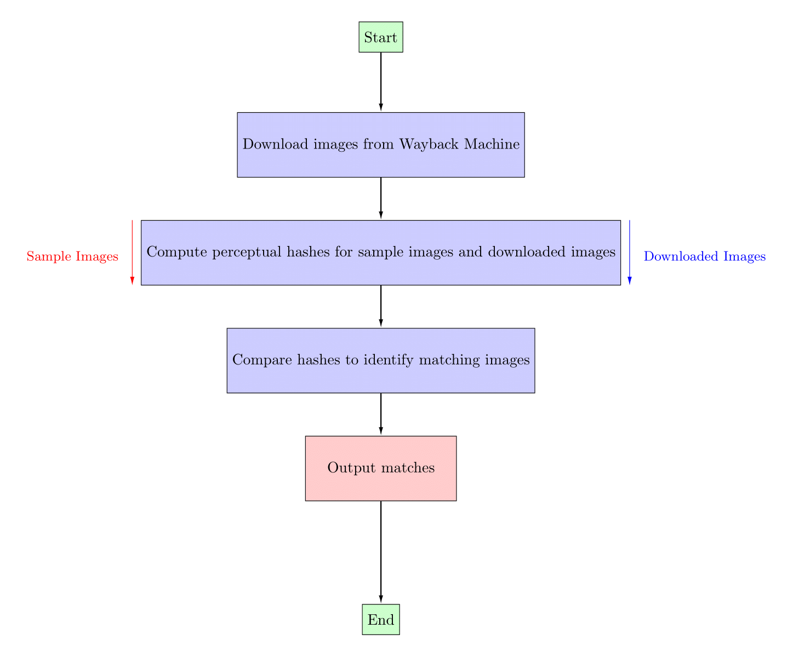

# JTKSearch

JTKSearch is a Python program that searches for a specific image (Jeff the Killer) on a given website between two specified dates. It does this by using the Wayback Machine Downloader tool to download all the images from the specified website between the specified dates. It then checks each downloaded image with a set of sample images to see if there is a match with the Jeff the Killer image.

## Prerequisites

- Python 3.6 or higher
- Ruby (for running wayback_machine_downloader tool). Ruby can be downloaded from https://www.ruby-lang.org/en/downloads/
- wayback_machine_downloader tool (https://github.com/hartator/wayback-machine-downloader#advanced-usage)

If you already have Ruby installed, then run this to install wayback machine downloader :
```
gem install wayback_machine_downloader
```
## Usage

**Windows**

1. Download the release version of JTKSearch, which includes an executable file.
4. Run the program by double-clicking the executable file
5. Follow the prompts to enter the website domain, start and end years for the search.

**Linux**

1. Download source code or clone it using git:
```
git clone https://github.com/lastdeve/JTKSearch
```
2. Run JTKSearch.py
```
python JTKSearch.py
```
3. Follow the prompts to enter the website domain, start and end years for the search.

Note: The program may take a while to run, depending on the size of the website and the number of images downloaded.

## How the comparison works

The comparison process of JTKSearch involves using the Perceptual Hash algorithm from the imagehash library to compute the similarity between the downloaded images and the sample images. This index calculates the degree of resemblance between two images based on their luminance, contrast, and structure. The comparison is carried out in two stages: firstly, each image is assessed to determine if it could be a potential match, and is placed in the Matches folder if it is. Subsequently, its similarity is calculated by comparing its relative likeness with the Jeff the Killer image. Therefore, it's possible that some images with a similarity of less than 1% could still be included in the Matches folder. This is because, although their relative similarity in comparison to an exact copy of Jeff the Killer is less than 1%, they still exhibit enough similarities to be considered a match.



## License

This program is licensed under the MIT License. See the LICENSE file for details.

## Disclaimer
The author(s) of this program are not responsible for any illegal activities performed with this software. It is the user's responsibility to comply with all applicable laws and regulations.